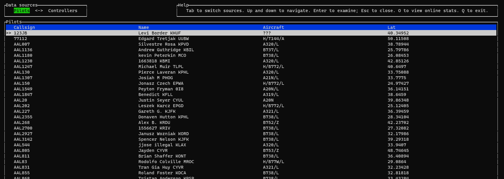

# vatsim_online

TUI to get basic information for users on VATSIM

## Building

1. Install Rust
1. Clone <https://github.com/Celeo/vatsim_online>
1. `cd vatsim_online`
1. `cargo build`

## Installing

Either build from source, or get a binary from the [releases page](https://github.com/Celeo/vatsim_online/releases).

## Using

Simply run the binary. Help text in the upper right summarizes the controls.

## License

Licensed under either of

* Apache License, Version 2.0, ([LICENSE-APACHE](LICENSE-APACHE))
* MIT license ([LICENSE-MIT](LICENSE-MIT))

## Contributing

Please feel free to contribute. Please open an issue first (or comment on an existing one) so that I know that you want to add/change something.

Unless you explicitly state otherwise, any contribution intentionally submitted for inclusion in the work by you, as defined in the Apache-2.0 license,
shall be dual licensed as above, without any additional terms or conditions.
